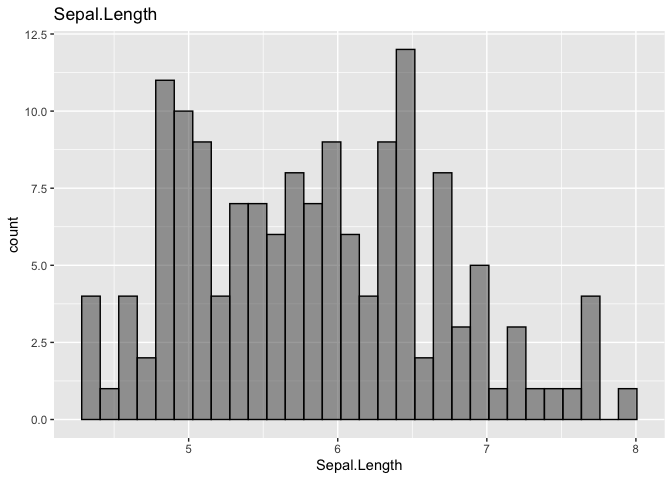
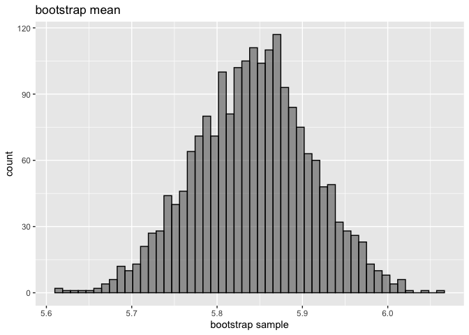
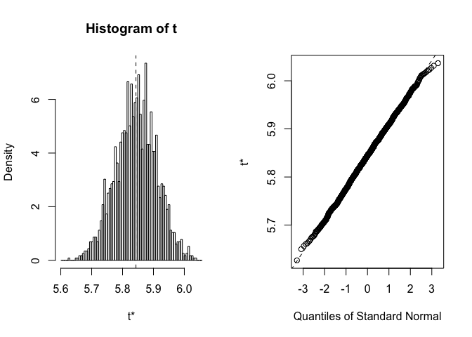

bootstarap\_test.R
================
Naho Tanigawa
9/12/2020

irisデータを利用して、ブートストラップ標本を作成し、平均値の信頼区間を推定したい。

``` r
# データの確認
gp <- ggplot(iris, aes(x = Sepal.Length,alpha=0.8)) +
  geom_histogram(bins = 30, color='black') + 
  ggtitle("Sepal.Length") +
  theme(legend.position = 'none')
gp
```

<!-- -->

## Generate Bootstrap samples

You can also embed plots, for example:

``` r
var(mean_boot)
```

    ## [1] 0.004589721

``` r
# [1] 0.004483655

plot_bootstrap_hist <- function(bootstrap_sample, title = "bootstrap mean"){
  gp <- bootstrap_sample %>% 
    as.data.frame %>% 
    ggplot(aes(x = .,alpha=0.8)) +
    geom_histogram(bins = 50, color='black') + 
    theme(legend.position = 'none')+
    ggtitle(title) +
    xlab("bootstrap sample")
  gp
}

plot_bootstrap_hist(mean_boot)
```

<!-- -->

``` r
# 両側95%信頼区間の算出
# 正規分布になっているから出せる
sort(mean_boot)[c(0.025*N, 0.975*N)]
```

    ## [1] 5.709333 5.972667

``` r
# bootパッケージを使う
library(tidyverse)
library(boot)

# 統計量を算出する関数を定義
my_mean <- function(d, i){
  b <- d[i,]
  mean(b$Sepal.Length)
}

ratio.boot <- boot(iris, statistic = my_mean, R=2000, stype = "i")
# ORDINARY NONPARAMETRIC BOOTSTRAP
# 
# 
# Call:
# boot(data = iris, statistic = my_mean, R = 2000, stype = "i")
# 
# 
# Bootstrap Statistics :
#     original       bias    std. error
# t1* 5.843333 0.0001436667  0.06789605

ratio.boot %>% plot
```

<!-- -->
